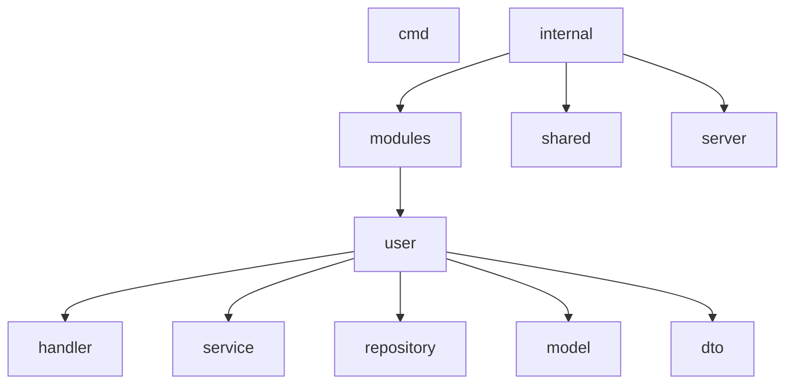

# Folder Structure

```mermaid
graph TD

A[cmd]

B[internal]

C[modules]

D[user]

E[handler]

F[service]

G[repository]

H[model]

I[dto]

J[shared]

K[server]

B --> C

B --> J

B --> K

C --> D

D --> E

D --> F

D --> G

D --> H

D --> I
```