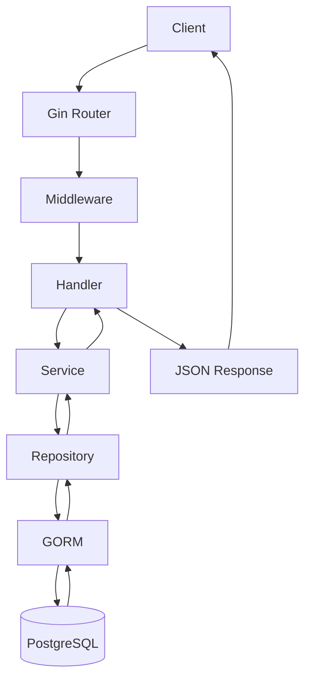

# HTTP Request Flow

```mermaid
flowchart TD

A[Client]

B[Gin Router]

C[Middleware]

D[Handler]

E[Service]

F[Repository]

G[GORM]

H[(PostgreSQL)]

I[JSON Response]

A --> B

B --> C

C --> D

D --> E

E --> F

F --> G

G --> H

H --> G

G --> F

F --> E

E --> D

D --> I

I --> A
```

---

## Description

Every request follows the layered architecture.

Client

↓

Router

↓

Middleware

↓

Handler

↓

Service

↓

Repository

↓

Database

↓

Response