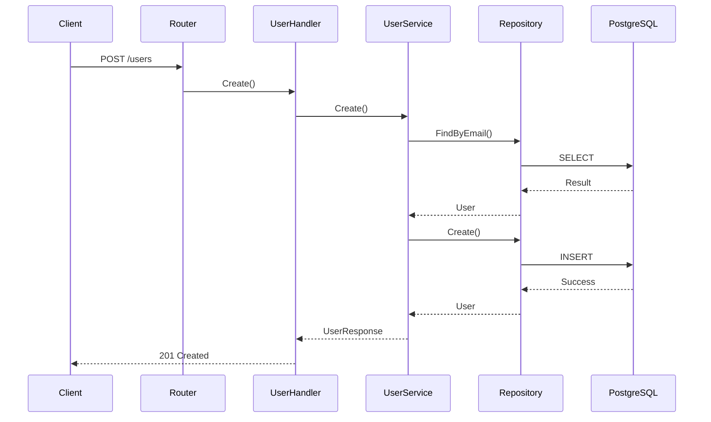

# Create User Sequence

```mermaid
sequenceDiagram

Client->>Router: POST /users

Router->>UserHandler: Create()

UserHandler->>UserService: Create()

UserService->>Repository: FindByEmail()

Repository->>PostgreSQL: SELECT

PostgreSQL-->>Repository: Result

Repository-->>UserService: User

UserService->>Repository: Create()

Repository->>PostgreSQL: INSERT

PostgreSQL-->>Repository: Success

Repository-->>UserService: User

UserService-->>UserHandler: UserResponse

UserHandler-->>Client: 201 Created
```